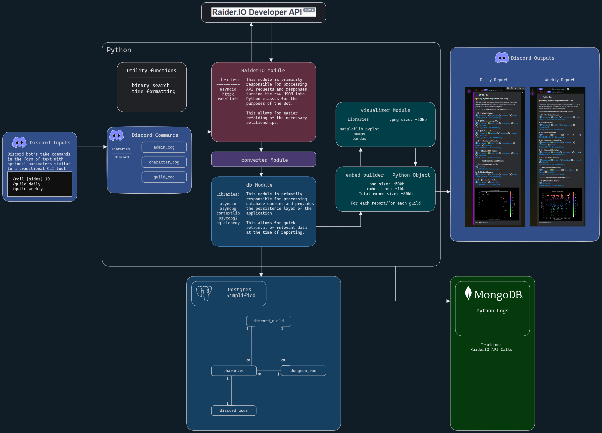

## Mythic+ Bot 

### A Discord bot that brings your guilds Mythic+ data directly to your Discord server.

Mythic+ Bot allows Discord server owners to define their own roster of players from accross a region and compile daily and weekly reports on the Mythic+ dungeon runs completed directly in Discord.

[Use the Railway Template available here.](https://railway.app/template/zLQuSb?referralCode=_EnWYp)

**Features:**
  - Add guild's wholesale with auto-updating rosters.
  - Add individual characters from any server in the region
  - Set up daily Mythic+ reports
  - Pull weekly Mythic+ reports
  - Query RaiderIO character data directly in discord
  
  - Coming soon - summary season reports for individual characters
  - Coming soon - summary season reports for Discord servers

[Check out the devblog here!](https://docs.eriim.dev/Projects/Mythic+Plus+Bot/1.+Mythic+Plus+Bot)

[Try out the bot or invite it to your server!](https://www.mythicplusbot.dev)

### Code Structure

